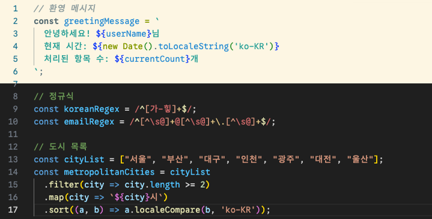
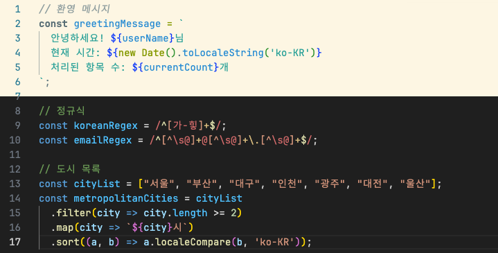

# Bon-Code-Fonts

Hybrid fixed-width monospace coding fonts, blended with popular Latin coding fonts and `Bon Gothic - 본고딕`.

## Overview

`Bon-Code-Fonts`' script automatically merge:
- **Latin characters** from popular coding fonts (supports both static and variable fonts)
- **Korean characters** from `Sarasa Fixed K` (Fixed-width monospace font, based on `Source Han Sans - 본고딕`)

## Available Fonts
### Bon Google Sans Code

- `Google Sans Code` + `Sarasa Fixed K`
- Available Weight: `Light`, `Regular`, `Bold`
- Available Style: `Regular`, `Italic`

### Bon JetBrains Mono

- `JetBrains Mono` + `Sarasa Fixed K`
- Available Weight: `Light`, `Regular`, `SemiBold`, `Bold`
- Available Style: `Regular`, `Italic`

## Quick Start
### Download Pre-built Fonts
1. Go to [Releases](../../releases)
2. Download the latest `Bon-*.zip`
3. Extract and install the `.ttf` files

### Usage in Popular Editors
#### VS Code
Go to `Preferences -> Settings -> Font Family`, or manually edit `setting.json`.
```json
{
  "editor.fontFamily": "Bon Google Sans Code, 'Courier New', monospace",
  "editor.fontSize": 14
}
```

#### IntelliJ IDEA / Android Studio
1. Go to `Settings → Editor → Font`
2. Select "Bon Google Sans Code" as Primary font

## Build from Source
```bash
# Clone repository
git clone https://github.com/potatosalad775/BonCodeFonts.git
cd BonCodeFonts

# Install dependencies  
npm install

# Build static fonts
npm run build:google-sans
npm run build:jetbrains-mono

# Build variable fonts (recommended)
npm run build:google-sans-variable
npm run build:jetbrains-mono-variable

# Test the output
npm test
```

**Note**: This repository includes all necessary source fonts released under the SIL Open Font License. 

See [SETUP.md](SETUP.md) for detailed build instructions.

## License

- **Sarasa Gothic**: SIL Open Font License 1.1
- **Google Sans Code**: SIL Open Font License 1.1
- **JetBrains Mono**: SIL Open Font License 1.1
- **Bon-Code-Fonts**: SIL Open Font License 1.1

See `LICENSE` file in `/sources/*` for full license text.